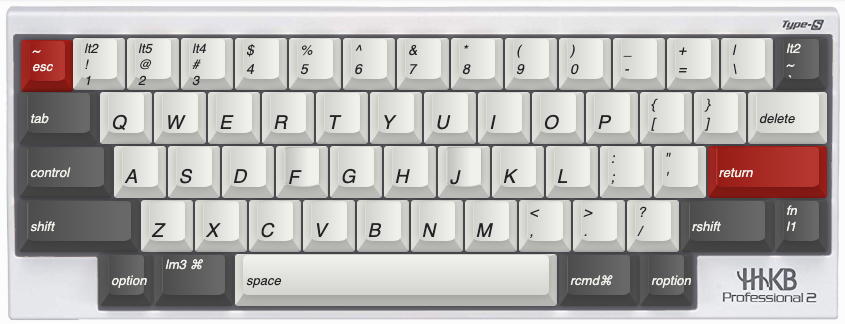
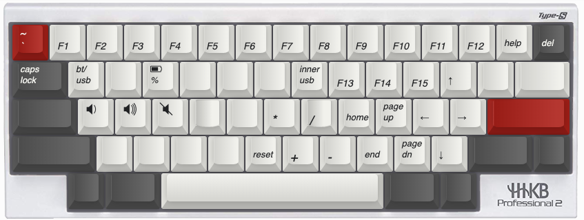
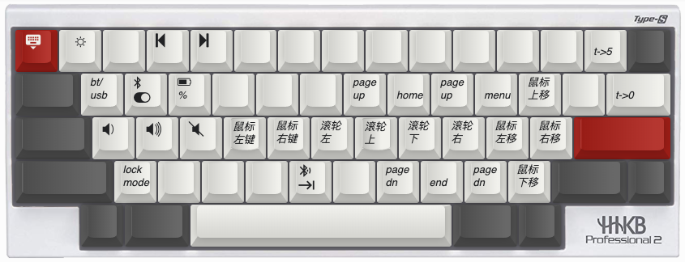
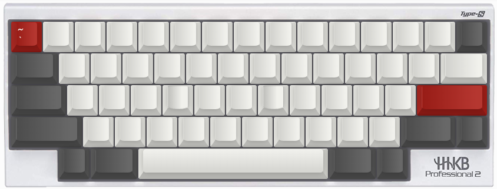
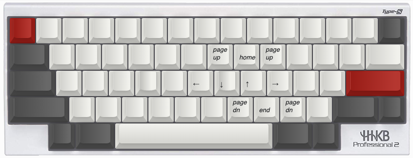
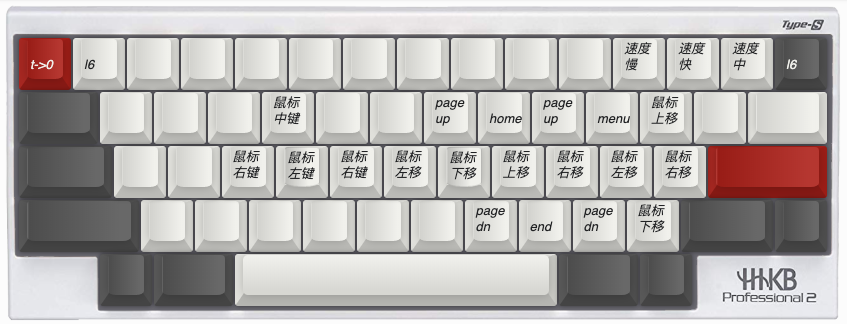
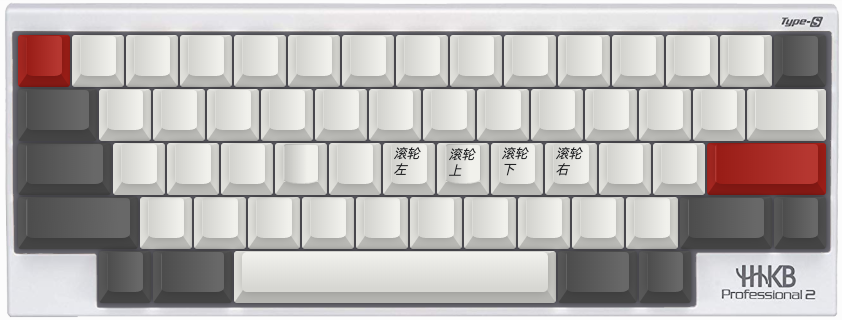

# HHKB YDKB 主控

> HHKB 键盘 + YDKB 主控 = 完美键盘

[YDKB 主控](http://ydkb.io/) 完美解决了旧版 HHKB BT 版本的问题。

所以在 HHKB Hybrid 发布前，最好用的蓝牙键盘是 hhkb type-s + ydkb.

## 蓝牙

HHKB + YDKB 没有难看的突起，内置充电电池，超长待机（超过3周），可边充电边使用，开机秒连，打字也几乎感觉不到延迟。主控还自带3个不同颜色的可编程LED灯，配合键位映射非常实用。

已知缺点：

1. 虽然默认的3级节电很给力，但在Word里会引发连击BUG。好在有解决方法：按左右Shift+P关闭节电就好了。(更新：最新固件0.8.1可能已经解决这个问题: [固件更新说明](http://help.ydkb.io/doku.php?id=ble-series:ble-firmware))
2. 多设备蓝牙切换很垃圾，官方宣称最好只接2个设备，而从 iPad 切换到 Mac 速度很快，但从 Mac 切换到 iPad 失败

但仍然算是接近完美的蓝牙解决方案。

## 键位映射

主控的官网上有很简单好用的键位映射编辑工具，编辑好之后也可以很简单地刷到主控里面，看官网中文文档就好，这里不细说了。

[YDKB 配置文档](HHKB_BLE.BIN)可以导入 YKDB 官网上的键位设置小工具作为参考，当前版本可使用链接直接打开： [分享链接](http://mrw.so/4OXqsg)

Layer 0 （默认配列)：

Layer 说明：

- 长按 Fn: 开启 Layer 1
- 长按 ~ (右上角按键) 或 长按数字 1 : 开启 Layer 2，主要是一些操作
- 长按 ⌘: 修饰键⌘ & 瞬时开启Layer 3, 这一层的按钮必须配合 ⌘
- 长按 2: 临时切换到鼠标层 Layer 5
- 长按 3：临时切换到 Layer 4，提供 vi 类光标移动操作
- ~ + \ (右上角2个按键)： 切换到鼠标操作层

配列简要说明：

- ⌘ + Esc： 映射为Layer3的 ⌘ + `，用于 Window Switcher
- Fn + E: 输出当前键盘电量
- ~ + Z: Lock Mode 休眠键盘，需要通过长按 F + J 唤醒，适合放入包内时使用
- ~ + B: 切换连接的蓝牙设备
- ~ + I: 切换内部 U盘

Layer 1 (Fn 操作)：

Layer 2 (长按 ~ 或 长按数字 1 )：

Layer 3 (只用于 ⌘ + `)：

Layer 4 ( vi 模拟操作层)：

鼠标模拟层操作：

- 长按 1： 切换 Layer 6，此时 hjkl 作为鼠标滚轮使用
- Esc: 退出鼠标模拟

Layer 5 鼠标操作层：

Layer 6 鼠标操作层：

灯状态：

- LED1: Caps Lock
- LED2: Layer 2
- LED3: Layer 5

## Mac下刷机方法

按住最左上角按键不放(物理位置，一般设置Esc)，插入数据线，电脑会识别出一个U盘名为 ***"HHKB_BLE"***，这时可放开Esc了。

进阶方法：在接 USB 线的情况下，同时按左右shift+b，此时键盘会重启，立即按住Esc不放，这样也可以进入刷机的U盘模式，好处就是整个操作过程不用插拔数据线。

Mac上操作需要按以下流程：

1. 先在U盘里删除固件里的”键盘名.bin“这个文件。
2. 再在废纸篓里也要删除它(对Mac来说这一步非常重要)。
3. 将新下载的bin保持文件名与之前删除的bin文件一样，再复制到U盘里(注意先后)。
4. 待文件复制完成后，右键推出U盘或按Esc退出，刷机完成。

如果电脑上还有其他键盘可用，上面的1和2这两步，可直接使用Cmd+Opt+Delete永久删除文件。

如果在废纸篓里也删除后，还是提示空间不足，那么退出刷机模式然后再重新进刷机模式，再重新操作。

# 版本

- 2020/1/4 支持鼠标层：http://mrw.so/4WyKfp
- 2020/1/4 使用layer5: http://mrw.so/4zg9WJ
- 2020/1/5 优化layer5: http://mrw.so/53lxGU
